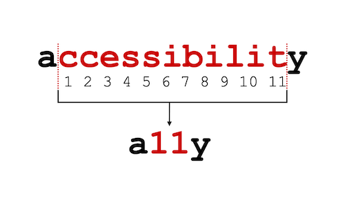

# This is where I can share documents with others

## Quick access
- [Accessibility](https://github.com/stephanie-K/documents-to-share#accessibility)
- [Zoom help](https://github.com/stephanie-K/documents-to-share#zoom-help)
- [Tube map yourself with draw.io](https://github.com/stephanie-K/documents-to-share#tube-map-yourself-with-drawio)
 
 

## Accessibility

I'm writing some material for [Code Your Future](https://codeyourfuture.io/) where I volunteer.
Feel free to use this as well:
- [Intro to Web Development Accessibility](https://docs.google.com/presentation/d/1CY7r_r8Zs6evWuQpGZK_E2zvXqNWbEEd5x5n1OhE6Rg/edit?usp=sharing)
- [Accessibility for developers - Basic](https://docs.google.com/presentation/d/15PG1w766J_EJGSVOnrjrn6ti_-K_7hdRjXZzA-sxTQ4/edit?usp=sharing)
- Accessibility for developers - Intermediate (coming soon)

I have some blog posts too:
- [Is my website accessible?](https://blog.chezleskrus.com/2020/10/31/is-my-website-accessible/)
- [Making your social media posts accessible](https://blog.chezleskrus.com/2019/11/14/making-your-social-media-posts-accessible/)
- [Accessibility Scotland Conference — 2019 edition](https://blog.chezleskrus.com/2019/10/27/accessibility-scotland-conference-2019-edition/)
- [Inclusion, Accessibility, Assisted digital needs - what’s the difference?](https://blog.chezleskrus.com/2019/10/16/inclusion-accessibility-assisted-digital-needs%e2%80%8a-%e2%80%8awhats-the-difference/)
- [Should you have to ‘come out’ as disabled when you have an invisible disability?](https://blog.chezleskrus.com/2019/10/13/should-you-have-to-come-out-as-disabled-when-you-have-an-invisible-disability/)

Good people for follow:
- [a11y project](https://a11yproject.com/resources)
- [Heydonworks](http://www.heydonworks.com/)
- [Adrian Roselli - blog](https://adrianroselli.com/)
- [Scott O'Hara - blog](https://www.scottohara.me/)
- [Leonie Watson](https://tink.uk/)
- [Sara Soueidan](https://www.sarasoueidan.com/tags/accessibility/)
- [Suzanne Aitchison](https://www.upyoura11y.com/)
 
 
## Zoom help

I created basic documents to guide people when they are new to Zoom

### For phone:
- The [**Google doc**](https://docs.google.com/presentation/d/1DIc5Q4apBMB1hGo-LUPMM9ivo_Rm3oVNr3d1u30RroU/edit?usp=sharing), so you can copy it and make changes to it if you want to.

**Some PDFs**
- [Join Zoom on a phone](/Zoom/Join_Zoom_on_a_phone.pdf)
- [Zoom functions on a phone](/Zoom/Zoom_functions_on_a_phone.pdf)
- [Join a Zoom breakout room on a phone](/Zoom/Join-Zoom-breakout-room-on-a-phone.pdf)

**Videos mades using the Google doc**
You have the files in the Zoom folder here. They are also on Youtube
- [Join Zoom on a phone](https://www.youtube.com/watch?v=3iHpGiTd9QA)
- [Zoom functions on a phone](https://www.youtube.com/watch?v=lcUKc9Ue3EI)
- [Join a Zoom breakout room on a phone](https://www.youtube.com/watch?v=Guujh_kseAE)

### For a laptop:
- The [**Google doc**](https://docs.google.com/presentation/d/1VVRv-Icv1gxCRN3Bs9jqvuW0UDfAr1xWxb8J1omhuPo/edit?usp=sharing), so you can copy it and make changes to it if you want to.

**Some PDFs**
- [Join Zoom on a laptop and main functions](/Zoom/zoom-help-for-laptop-join.pdf)
- [Join a Zoom breakout room on a laptop](/Zoom/Zoom-help-breakout-room-for-laptop.pdf)

**Videos mades using the Google doc**
You have the files in the Zoom folder here. They are also on Youtube
- [Join Zoom on a laptop](https://www.youtube.com/watch?v=d9pSd5M4YmE)
- [Join a Zoom breakout room on a laptop](https://www.youtube.com/watch?v=gkCtG_WT8RU)
 
 
## Tube map yourself with [draw.io](draw.io)
**The article can be found [my blog](https://blog.chezleskrus.com/2019/11/19/tube-map-make-your-own/)**
 
 

 
 
 

The video showing how to make an elbow in a line:

